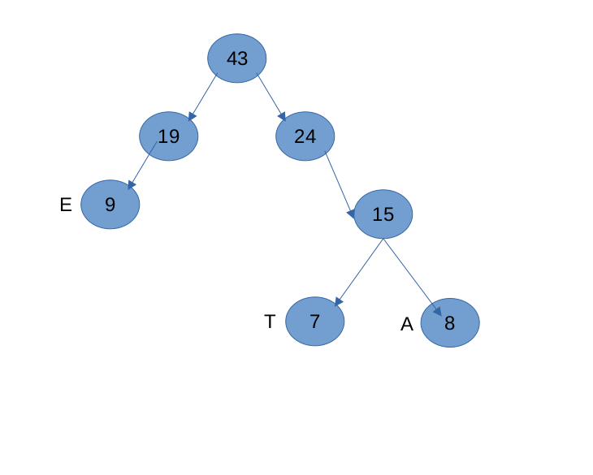

# Huffman Compression

## Resumen del proyecto
Este proyecto implementa un algoritmo de compresión de datos utilizando el algoritmo de Huffman. El algoritmo de Huffman es una técnica de compresión sin pérdida que asigna códigos de longitud variable a los diferentes símbolos de entrada, de manera que los símbolos más frecuentes tienen códigos más cortos y los símbolos menos frecuentes tienen códigos más largos. Esto permite reducir el tamaño del archivo sin perder información.

video explicacion(https://drive.google.com/file/d/1DloDOdvOU9XvYP-upmvF-WBMo-YtaBc1/view?usp=drive_link)

## Proceso de compresión de Huffman
A continuación se muestra una gráfica que ilustra el proceso de compresión de Huffman:

## Instalación
1. Clona este repositorio en tu máquina local.
2. Asegúrate de tener Java JDK 19 instalado en tu sistema.
3. Compila el código fuente utilizando el siguiente comando:
   javac HuffmanCompression.java

## Uso
1. Coloca el archivo de texto que deseas comprimir en el directorio del proyecto y asegúrate de que se llame `input.txt`.
2. Ejecuta el programa utilizando el siguiente comando:
   java HuffmanCompression
3. El programa generará un archivo codificado llamado `encoded.txt` y un archivo decodificado llamado `decoded.txt`.
4. Puedes modificar el archivo `HuffmanCompression.java` para personalizar la ubicación y los nombres de los archivos de entrada y salida según tus necesidades.

# Autores 
Victor Manuel Osorio
Santiago Medina Varon

